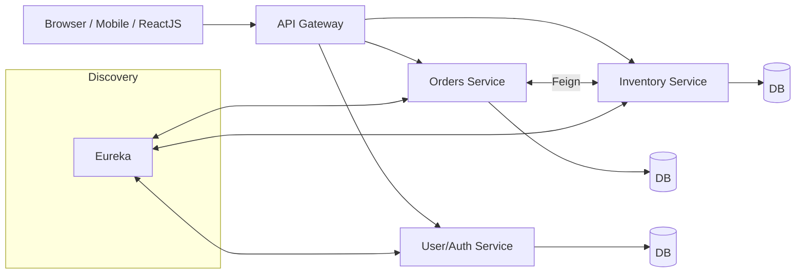

# 🚀 springBoot_TUT

A collection of Spring Boot learning projects and mini-services demonstrating core Spring concepts and production-ready patterns. This repository consolidates multiple modules that cover fundamentals (configuration, profiles, actuators), REST APIs with Spring Data JPA and Spring Data REST, database connectivity, and Spring Security basics. It also includes guidance and starter snippets for commonly used microservices components you may add next (OpenFeign, Eureka, JWT auth, ReactJS, etc.). ✨


## 📦 Repository overview

This is a multi-module learning workspace. Notable modules and what they demonstrate:

- 01-spring-boot-overview
  - 02-dev-tools-demo — ⚡ Live reload with Spring Boot DevTools
  - 03-actuators-demo — 🩺 Spring Boot Actuator endpoints, info/health exposure
  - 05-command-line-demo — 🏁 Using CommandLineRunner/ApplicationRunner
  - 06-properties-demo — ⚙️ Externalized configuration, info metadata
- 02-spring-boot-spring-core
  - 05-primary — 🧭 Primary beans and injection behavior
  - 06-lazy-initialization — 💤 Lazy bean initialization
  - 07-scope-beans — 🧩 Prototype/singleton scopes
- 04-spring-boot-rest-crud
  - 04-spring-boot-rest-crud-employee -with-spring-data-rest — 🧠 REST CRUD with Spring Data JPA and Spring Data REST
- SpringSecEx — 🔐 Spring Security (basic configuration backed by a database)
- store — 🛍️ A simple service using Spring MVC + Spring Security + MySQL

Note: Module names may include spaces (as seen in the employee Data REST demo). Keep your IDE configured to handle such paths correctly. 🧑‍💻


## 🧰 Tech stack used in this repo (from code)

- ☕ Java (Spring Boot ecosystem)
- 🩺 Spring Boot Actuator (01/03-actuators-demo)
- ⚡ Spring Boot DevTools (01/02-dev-tools-demo)
- 🌐 Spring MVC / REST Controllers
- 🗂️ Spring Data JPA
- 🤖 Spring Data REST (04-spring-boot-rest-crud-employee -with-spring-data-rest)
- 🔐 Spring Security (SpringSecEx, store)
- 🐬 MySQL (store, SpringSecEx)
- ⚙️ Externalized configuration via application.properties

Planned/optional extensions (snippets provided below for future integration):
- 🧩 Microservices patterns (service discovery with Eureka, inter-service calls with OpenFeign)
- 🛡️ JWT-based Authentication/Authorization
- 🐘 PostgreSQL (alternative to MySQL)
- ⚛️ ReactJS frontend


## ▶️ Run locally

Each module is a standalone Spring Boot app. Open the module in your IDE or run from CLI.

Generic:
- ☕ Java 17+ recommended (adjust per your environment)
- 🏗️ Build tool: use the module’s build (Maven or Gradle) as configured in that module

Example (Gradle):
```bash
./gradlew bootRun
```

Example (Maven):
```bash
mvn spring-boot:run
```

Ports:
- Many modules use `server.port=8085` in `application.properties`. If you run multiple modules simultaneously, change ports to avoid conflicts. 🔀


## ⚙️ Configuration examples (from this repo)

Actuator and app metadata (01-spring-boot-overview/03-actuators-demo, 06-properties-demo):
```properties
management.endpoints.web.exposure.include=*
management.info.env.enabled=true

info.app.name=My Super Cool App
info.app.description=A crazy fun app, yahoo!
info.app.version=1.O.O
```

Spring Data REST base path (04-spring-boot-rest-crud-employee -with-spring-data-rest):
```properties
spring.data.rest.base-path=/magic-api
spring.data.rest.default-page-size=3
```

MySQL configuration (store):
```properties
spring.datasource.url=jdbc:mysql://localhost:3306/store
spring.datasource.username=springstudent
spring.datasource.password=springstudent
spring.jpa.hibernate.ddl-auto=none
```

Spring Security default user (for quick demos; not for production):
```properties
spring.security.user.name=user
spring.security.user.password=user
```

Spring Security DB-backed example (SpringSecEx):
```properties
spring.datasource.url=jdbc:mysql://localhost:3306/spring_sec
spring.datasource.username=springstudent
spring.datasource.password=springstudent
```


## 🧩 REST + Data JPA pattern

Typical stack used in the CRUD demos:
- 🧱 Entity → 📚 Repository (extends JpaRepository) → 🎯 Controller/Service OR auto-exposed via Spring Data REST

Example repository:
```java
public interface EmployeeRepository extends JpaRepository<Employee, Long> {}
```

Example controller (manual REST style):
```java
@RestController
@RequestMapping("/api/employees")
@RequiredArgsConstructor
public class EmployeeController {
  private final EmployeeRepository repo;

  @GetMapping
  public List<Employee> all() { return repo.findAll(); }

  @PostMapping
  public Employee create(@RequestBody Employee e) { return repo.save(e); }
}
```

Using Spring Data REST (auto-exposed):
- Base path from properties, e.g., `/magic-api/employees`
- Pagination/sorting exposed automatically 📄


## 🔐 Spring Security (current state and recommended configuration)

If you’re on Spring Security 6+, configure via `SecurityFilterChain`:
```java
@Configuration
@EnableWebSecurity
public class SecurityConfig {

  @Bean
  SecurityFilterChain web(HttpSecurity http) throws Exception {
    http
      .csrf(csrf -> csrf.disable()) // consider CSRF for browser apps
      .authorizeHttpRequests(auth -> auth
        .requestMatchers("/actuator/**").permitAll()
        .anyRequest().authenticated()
      )
      .httpBasic(Customizer.withDefaults()); // or formLogin()

    return http.build();
  }
}
```

For the demo modules, you can start with basic auth (as above) and later switch to JWT (see below). 🛡️


## 🗺️ Architecture and flow

Current learning architecture (single service or a few independent services, REST + DB):

```mermaid
flowchart LR
  Client[REST Client (curl/Postman/Browser)]
  API[Spring Boot App\n(REST Controllers / Data REST)]
  DB[(MySQL)]

  Client -->|HTTP/JSON| API
  API -->|JPA| DB
```

Pluggable components demonstrated:
- 🩺 Actuator for ops/health/info
- ⚙️ Externalized config for environment-specific settings
- 🔐 Spring Security for baseline protection
- 🗂️ Data JPA and/or Data REST for CRUD


## 🧭 Roadmap: Microservices, OpenFeign, Eureka, JWT, ReactJS

The following sections show how to integrate these technologies when you split services and scale this repo from tutorials to production-grade architecture.

### 🧭 Service Discovery (Eureka) and OpenFeign

Add Eureka Server:
```xml
<!-- pom.xml -->
<dependency>
  <groupId>org.springframework.cloud</groupId>
  <artifactId>spring-cloud-starter-netflix-eureka-server</artifactId>
</dependency>
```

```java
@SpringBootApplication
@EnableEurekaServer
public class DiscoveryServerApplication {
  public static void main(String[] args) {
    SpringApplication.run(DiscoveryServerApplication.class, args);
  }
}
```

```yaml
# application.yml (server)
server:
  port: 8761
eureka:
  client:
    register-with-eureka: false
    fetch-registry: false
```

Register a client service with Eureka and enable Feign:
```xml
<!-- pom.xml -->
<dependency>
  <groupId>org.springframework.cloud</groupId>
  <artifactId>spring-cloud-starter-netflix-eureka-client</artifactId>
</dependency>
<dependency>
  <groupId>org.springframework.cloud</groupId>
  <artifactId>spring-cloud-starter-openfeign</artifactId>
</dependency>
```

```java
@SpringBootApplication
@EnableDiscoveryClient
@EnableFeignClients
public class OrdersApplication { /* ... */ }
```

```yaml
# application.yml (client)
spring:
  application:
    name: orders-service

eureka:
  client:
    service-url:
      defaultZone: http://localhost:8761/eureka
```

Define a Feign client to call another service by name:
```java
@FeignClient(name = "inventory-service")
public interface InventoryClient {
  @GetMapping("/api/inventory/{sku}")
  InventoryDto bySku(@PathVariable String sku);
}
```

### 🛡️ JWT Authentication & Authorization

Add dependencies:
```xml
<dependency>
  <groupId>org.springframework.boot</groupId>
  <artifactId>spring-boot-starter-security</artifactId>
</dependency>
<dependency>
  <groupId>io.jsonwebtoken</groupId>
  <artifactId>jjwt-api</artifactId>
  <version>0.11.5</version>
</dependency>
<dependency>
  <groupId>io.jsonwebtoken</groupId>
  <artifactId>jjwt-impl</artifactId>
  <version>0.11.5</version>
  <scope>runtime</scope>
</dependency>
<dependency>
  <groupId>io.jsonwebtoken</groupId>
  <artifactId>jjwt-jackson</artifactId>
  <version>0.11.5</version>
  <scope>runtime</scope>
</dependency>
```

Configure a JWT filter (simplified example):
```java
@Component
public class JwtAuthFilter extends OncePerRequestFilter {

  private final JwtService jwtService;

  public JwtAuthFilter(JwtService jwtService) {
    this.jwtService = jwtService;
  }

  @Override
  protected void doFilterInternal(HttpServletRequest request,
                                  HttpServletResponse response,
                                  FilterChain chain) throws IOException, ServletException {
    String auth = request.getHeader("Authorization");
    if (auth != null && auth.startsWith("Bearer ")) {
      String token = auth.substring(7);
      Authentication authn = jwtService.parse(token);
      SecurityContextHolder.getContext().setAuthentication(authn);
    }
    chain.doFilter(request, response);
  }
}
```

Wire it in:
```java
@Configuration
@EnableWebSecurity
public class SecurityConfig {
  @Bean
  SecurityFilterChain web(HttpSecurity http, JwtAuthFilter jwt) throws Exception {
    http
      .csrf(csrf -> csrf.disable())
      .authorizeHttpRequests(auth -> auth
        .requestMatchers("/auth/**", "/actuator/**").permitAll()
        .anyRequest().authenticated()
      )
      .addFilterBefore(jwt, UsernamePasswordAuthenticationFilter.class);
    return http.build();
  }
}
```

Clients send:
```
Authorization: Bearer <JWT>
```

### 🐘 PostgreSQL (alternative DB)

To switch a module to Postgres:
```properties
spring.datasource.url=jdbc:postgresql://localhost:5432/mydb
spring.datasource.username=postgres
spring.datasource.password=postgres
spring.jpa.hibernate.ddl-auto=validate
spring.jpa.properties.hibernate.dialect=org.hibernate.dialect.PostgreSQLDialect
```

Gradle/Maven dependency:
```xml
<dependency>
  <groupId>org.postgresql</groupId>
  <artifactId>postgresql</artifactId>
  <version>42.7.5</version>
</dependency>
```

### ⚛️ ReactJS frontend

Structure suggestion:
```
/frontend
  package.json
  src/
    App.jsx
    components/
    pages/
```

Basic startup:
```bash
npm create vite@latest frontend -- --template react
cd frontend
npm install
npm run dev
```

Consume your Spring APIs via fetch/axios:
```js
const res = await fetch('http://localhost:8085/api/employees');
const data = await res.json();
```

### 🏗️ Target microservices architecture (future)



Key patterns:
- 🔎 Service discovery with Eureka
- 🔁 Client-side load-balancing with OpenFeign + Spring Cloud LoadBalancer
- 🛡️ JWT-based auth at gateway or per service
- 🧰 Centralized config (Spring Cloud Config) and Observability (Actuator + Prometheus/Grafana/Zipkin)


## 🧪 Testing pointers

- 🌐 Spring MVC tests: `@WebMvcTest`
- 🗄️ JPA tests: `@DataJpaTest`
- 🔐 Security tests: `@WithMockUser`, `SecurityMockMvcRequestPostProcessors.jwt()`
- 🧪 Testcontainers for real DBs (MySQL/Postgres) in CI


## 🏭 Production-readiness checklist

- 🧩 Profiles: `application-{env}.properties` for dev/stage/prod
- 🔐 External secrets (env vars, vault)
- 🗃️ Database migrations (Liquibase/Flyway)
- 📊 Centralized logging, metrics, tracing
- 📜 API docs (Springdoc OpenAPI)
- 🤖 CI/CD pipeline
- 📦 Containerization (Docker) and Orchestration (Kubernetes)


## 🤝 Contributing

- Keep each learning module focused on one topic
- Prefer small, runnable examples
- Add a README inside each module describing what it demonstrates


## 📄 License

This repository is intended for learning purposes. Add a LICENSE file as appropriate for your distribution needs.


---

📝 Notes on accuracy:
- From the code in this repository, 🐬 MySQL, 🗂️ Spring Data JPA/REST, 🔐 Spring Security, ⚡ DevTools, and 🩺 Actuator are used.
- 🐘 PostgreSQL, 🔎 Eureka, 🤝 OpenFeign, 🛡️ JWT, and ⚛️ ReactJS are included here as ready-to-use patterns and snippets for future expansion.