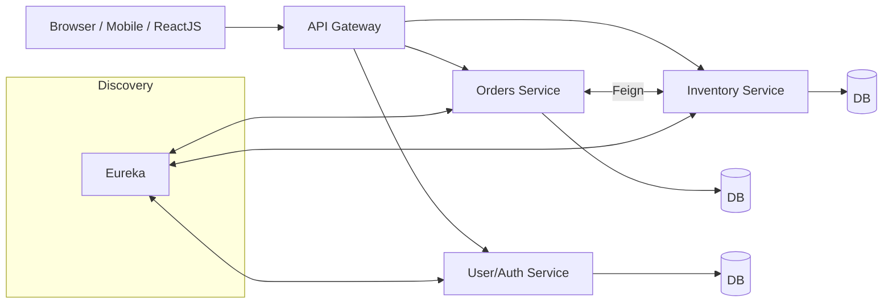

  # Quiz App — Microservices backend + React frontend

  Production-style Quiz platform built with Spring Boot microservices and a React (Vite) frontend. It features JWT-based authentication, role-based access (TEACHER/STUDENT), a question bank, quiz creation, submissions, and teacher analytics — all fronted by a Spring Cloud API Gateway and registered with Eureka.

  This README focuses on the backend and deployment. It also includes Docker guidance and concrete improvements to make the system more reliable and scalable.

  ## What’s inside

  - Backend (Spring Boot microservices)
    - Service Registry (Eureka)
    - API Gateway (Spring Cloud Gateway + JWT filter)
    - User Service (auth, users, roles)
    - Question Service (question bank)
    - Quiz Service (quizzes, submissions, analytics)
  - Frontend (React + Vite)
  - PostgreSQL databases (one per service)

  Folder roots in this repo:

  ```
  backend/
    microservices/
      api-gateway/
      service-registry/
      user-service/
      questionService/
      quizService/
      quizApp/           # legacy/experimental module; not used by the gateway
  frontend/
    quiz-app/
  ```

  ## Architecture overview

  High-level flow:

  1. Frontend calls the API via the gateway (http://localhost:8765)
  2. Gateway validates JWT, enforces RBAC, propagates username to downstream services
  3. Services are registered/discovered via Eureka (http://localhost:8761)
  4. Each service persists to its own Postgres database

  Ports and base paths (defaults from the repo configs):

  - Service Registry (Eureka): 8761
  - API Gateway: 8765
  - User Service: 8091, base path: /auth/\*\*
  - Question Service: 8086, base path: /question/\*\*
  - Quiz Service: 8081, base path: /quiz/\*\*
  - Frontend (Vite dev): 5173

  CORS: gateway allows http://localhost:5173 by default.

  ## Backend services (details)

  All services are Spring Boot apps using Maven, registered with Eureka, and (in Docker) connect to a Postgres container at hostname postgres-db.

  ### 1) Service Registry (Eureka)

  - Path: `backend/microservices/service-registry`
  - Port: 8761
  - Purpose: Service discovery for dynamic routing and health tracking.

  ### 2) API Gateway (Spring Cloud Gateway)

  - Path: `backend/microservices/api-gateway`
  - Port: 8765
  - Routes:
    - /quiz/\*\* -> QUIZ-SERVICE
    - /question/\*\* -> QUESTION-SERVICE
    - /auth/\*\* -> USER-SERVICE
  - Cross-cutting concerns:
    - Validates JWT on incoming requests
    - Extracts role and username from token
    - Enforces RBAC (e.g., only TEACHER can create quizzes)
    - Injects `username` header to downstream services so controllers don’t need to parse JWT

  ### 3) User Service (Auth & Users)

  - Path: `backend/microservices/user-service`
  - Port: 8091
  - DB: `userdb`
  - Responsibilities:
    - Registration, login, and issuing JWTs
    - Expose role lookup for current token (used by the frontend after login)
    - Store users with roles: TEACHER/STUDENT

  ### 4) Question Service

  - Path: `backend/microservices/questionService`
  - Port: 8086
  - DB: `questiondb`
  - Responsibilities:
    - CRUD for question bank (teachers only for create/update)
    - Query by topic/difficulty, etc.

  ### 5) Quiz Service

  - Path: `backend/microservices/quizService`
  - Port: 8081
  - DB: `quizdb`
  - Responsibilities:
    - Create quizzes (teacher)
    - Attach questions and publish
    - Submit attempts (student)
    - Return detailed result and analytics per quiz/user

  Note: A separate module `backend/microservices/quizApp` exists with its own config (port 8085). It’s not used by the gateway and can be ignored or removed.

  ## Local development (no Docker)

  Prerequisites:

  - JDK 17+
  - Maven 3.9+
  - Node.js 18+
  - PostgreSQL running locally (or change configs to match your setup)

  Start order (recommended):

  1. Service Registry

     - Open `backend/microservices/service-registry`
     - Build and run

     ```powershell
     mvn -q -DskipTests clean package
     mvn spring-boot:run
     ```

     Eureka UI: http://localhost:8761

  2. Databases

     - Create three databases locally (or update service configs):

     ```sql
     CREATE DATABASE userdb;
     CREATE DATABASE questiondb;
     CREATE DATABASE quizdb;
     ```

  3. User, Question, Quiz services

     - Each service’s config points to a database. By default, some services in this repo use `postgres-db` as the hostname (for Docker). For local dev, change the `spring.datasource.url` to `jdbc:postgresql://127.0.0.1:5432/<dbname>` if needed.
     - Build and run each service in its folder:

     ```powershell
     mvn -q -DskipTests clean package
     mvn spring-boot:run
     ```

  4. API Gateway

     - Open `backend/microservices/api-gateway`
     - Run the same Maven commands
     - Gateway: http://localhost:8765

  5. Frontend
     - Open `frontend/quiz-app`
     ```powershell
     npm install
     npm run dev
     ```
     - App: http://localhost:5173 (proxied through the gateway endpoints)

  ## Docker & Containerization

  This repo’s service configs already assume a Docker network hostname `postgres-db`. The recommended approach is Docker Compose with one Postgres container and one container per service.

  ### Option A — Use the sample Dockerfiles (snippets)

  Add a Dockerfile next to each Spring Boot service (multi-stage build):

  ```dockerfile
  # Dockerfile (place in a service folder, e.g., backend/microservices/quizService)
  FROM maven:3.9-eclipse-temurin-17 AS build
  WORKDIR /app
  COPY . .
  RUN mvn -q -DskipTests clean package

  FROM eclipse-temurin:17-jre
  WORKDIR /app
  COPY --from=build /app/target/*.jar app.jar
  EXPOSE 8080
  ENTRYPOINT ["java", "-jar", "/app/app.jar"]
  ```

  For the frontend (build static and serve via Nginx):

  ```dockerfile
  # Dockerfile (frontend/quiz-app)
  FROM node:18 AS build
  WORKDIR /app
  COPY package*.json ./
  RUN npm ci
  COPY . .
  RUN npm run build

  FROM nginx:alpine
  COPY --from=build /app/dist /usr/share/nginx/html
  EXPOSE 80
  CMD ["nginx", "-g", "daemon off;"]
  ```

  ### Option B — Sample docker-compose.yml

  Below is a compose file you can adapt and save as `docker-compose.yml` in the repo root. It creates Postgres with all three databases and runs all services + frontend.

  ```yaml
  version: "3.9"
  services:
    postgres-db:
      image: postgres:15
      container_name: postgres-db
      environment:
        POSTGRES_USER: postgres
        POSTGRES_PASSWORD: aryan
      ports:
        - "5432:5432"
      volumes:
        - postgres_data:/var/lib/postgresql/data
        - ./_ops/init.sql:/docker-entrypoint-initdb.d/init.sql:ro

    service-registry:
      build: ./backend/microservices/service-registry
      ports:
        - "8761:8761"
      depends_on:
        - postgres-db

    api-gateway:
      build: ./backend/microservices/api-gateway
      ports:
        - "8765:8765"
      environment:
        - EUREKA_CLIENT_SERVICEURL_DEFAULTZONE=http://service-registry:8761/eureka
      depends_on:
        - service-registry
        - user-service
        - question-service
        - quiz-service

    user-service:
      build: ./backend/microservices/user-service
      ports:
        - "8091:8091"
      environment:
        - SPRING_DATASOURCE_URL=jdbc:postgresql://postgres-db:5432/userdb
        - SPRING_DATASOURCE_USERNAME=postgres
        - SPRING_DATASOURCE_PASSWORD=aryan
        - EUREKA_CLIENT_SERVICEURL_DEFAULTZONE=http://service-registry:8761/eureka
      depends_on:
        - postgres-db
        - service-registry

    question-service:
      build: ./backend/microservices/questionService
      ports:
        - "8086:8086"
      environment:
        - SPRING_DATASOURCE_URL=jdbc:postgresql://postgres-db:5432/questiondb
        - SPRING_DATASOURCE_USERNAME=postgres
        - SPRING_DATASOURCE_PASSWORD=aryan
        - EUREKA_CLIENT_SERVICEURL_DEFAULTZONE=http://service-registry:8761/eureka
      depends_on:
        - postgres-db
        - service-registry

    quiz-service:
      build: ./backend/microservices/quizService
      ports:
        - "8081:8081"
      environment:
        - SPRING_DATASOURCE_URL=jdbc:postgresql://postgres-db:5432/quizdb
        - SPRING_DATASOURCE_USERNAME=postgres
        - SPRING_DATASOURCE_PASSWORD=aryan
        - EUREKA_CLIENT_SERVICEURL_DEFAULTZONE=http://service-registry:8761/eureka
      depends_on:
        - postgres-db
        - service-registry

    frontend:
      build: ./frontend/quiz-app
      ports:
        - "5173:80"
      depends_on:
        - api-gateway

  volumes:
    postgres_data:
  ```

  Create an init script to provision the three databases. Save as `_ops/init.sql`:

  ```sql
  CREATE DATABASE userdb;
  CREATE DATABASE questiondb;
  CREATE DATABASE quizdb;
  ```

  Then build and run:

  ```powershell
  docker compose build
  docker compose up -d
  ```

  Gateway: http://localhost:8765, Frontend: http://localhost:5173, Eureka: http://localhost:8761

  ## Security and RBAC

  - JWT is validated in the gateway; public paths like `/auth/**` are allowed.
  - Gateway extracts `role` and `username` from JWT and injects them downstream.
  - RBAC examples:
    - Only TEACHER can create quizzes or questions
    - STUDENT can take quizzes and view their results
    - Teacher analytics are protected

  Tips:

  - Store secrets (JWT secret, DB password) in environment variables — avoid committing them into `application.yml`.
  - Prefer HTTPS and secure cookies in production.

  ## Troubleshooting

  - 403 on /auth/register: ensure the request is routed through the gateway and the user-service is reachable. `/auth/**` should be excluded from auth checks at the gateway.
  - CORS errors in browser: verify `api-gateway` CORS allows `http://localhost:5173`.
  - Service won’t register: confirm Eureka at http://localhost:8761 and the `EUREKA_CLIENT_SERVICEURL_DEFAULTZONE` env var for containers.
  - Database connection refused: check `postgres-db` container logs; confirm databases exist (`userdb`, `questiondb`, `quizdb`).

  ## Areas for improvement (reliability + scale)

  - Database migrations: add Flyway or Liquibase per service to version schemas
  - Centralized config: Spring Cloud Config Server (externalize `application.yml` and secrets)
  - Observability: Micrometer + Prometheus + Grafana; tracing via OpenTelemetry + Tempo/Jaeger; log aggregation via ELK/EFK
  - Resilience patterns: Resilience4j (circuit breaker/retry/bulkhead); timeouts and fallbacks on all client calls
  - API Gateway: rate limiting, request size limits, and audit logging
  - Messaging: Kafka or RabbitMQ for async flows (quiz submission processing, analytics)
  - Caching: Redis for hot queries (question catalogs, quiz metadata)
  - Search & pagination: index commonly queried fields, add pageable endpoints
  - Security: BCrypt password hashing, refresh tokens, JWT rotation/blacklist, per-service service-to-service auth (mTLS or signed internal tokens)
  - Data integrity: idempotency keys for submissions; SAGA/outbox patterns for cross-service consistency
  - CI/CD: GitHub Actions pipeline (build, test, scan, build images, push, deploy)
  - Containers: set JVM memory limits, health endpoints, readiness probes; horizontal scaling via replicas
  - Frontend: bundle splitting, error boundaries, SSO-ready auth layer

  ## License

  MIT

  ***

  Quick reference

  - Gateway base URL: http://localhost:8765
  - Frontend dev: http://localhost:5173
  - Eureka dashboard: http://localhost:8761
  - Default Postgres creds in compose: postgres / aryan (override in env for production)
    @GetMapping
    public List<Employee> all() { return repo.findAll(); }

  @PostMapping
  public Employee create(@RequestBody Employee e) { return repo.save(e); }
  }

````

Using Spring Data REST (auto-exposed):
- Base path from properties, e.g., `/magic-api/employees`
- Pagination/sorting exposed automatically 📄


## 🔐 Spring Security (current state and recommended configuration)

If you’re on Spring Security 6+, configure via `SecurityFilterChain`:
```java
@Configuration
@EnableWebSecurity
public class SecurityConfig {

  @Bean
  SecurityFilterChain web(HttpSecurity http) throws Exception {
    http
      .csrf(csrf -> csrf.disable()) // consider CSRF for browser apps
      .authorizeHttpRequests(auth -> auth
        .requestMatchers("/actuator/**").permitAll()
        .anyRequest().authenticated()
      )
      .httpBasic(Customizer.withDefaults()); // or formLogin()

    return http.build();
  }
}
````

For the demo modules, you can start with basic auth (as above) and later switch to JWT (see below). 🛡️

## 🗺️ Architecture and flow

Current learning architecture (single service or a few independent services, REST + DB):

```mermaid
flowchart LR
  Client[REST Client (curl/Postman/Browser)]
  API[Spring Boot App\n(REST Controllers / Data REST)]
  DB[(MySQL)]

  Client -->|HTTP/JSON| API
  API -->|JPA| DB
```

Pluggable components demonstrated:

- 🩺 Actuator for ops/health/info
- ⚙️ Externalized config for environment-specific settings
- 🔐 Spring Security for baseline protection
- 🗂️ Data JPA and/or Data REST for CRUD

## 🧭 Roadmap: Microservices, OpenFeign, Eureka, JWT, ReactJS

The following sections show how to integrate these technologies when you split services and scale this repo from tutorials to production-grade architecture.

### 🧭 Service Discovery (Eureka) and OpenFeign

Add Eureka Server:

```xml
<!-- pom.xml -->
<dependency>
  <groupId>org.springframework.cloud</groupId>
  <artifactId>spring-cloud-starter-netflix-eureka-server</artifactId>
</dependency>
```

```java
@SpringBootApplication
@EnableEurekaServer
public class DiscoveryServerApplication {
  public static void main(String[] args) {
    SpringApplication.run(DiscoveryServerApplication.class, args);
  }
}
```

```yaml
# application.yml (server)
server:
  port: 8761
eureka:
  client:
    register-with-eureka: false
    fetch-registry: false
```

Register a client service with Eureka and enable Feign:

```xml
<!-- pom.xml -->
<dependency>
  <groupId>org.springframework.cloud</groupId>
  <artifactId>spring-cloud-starter-netflix-eureka-client</artifactId>
</dependency>
<dependency>
  <groupId>org.springframework.cloud</groupId>
  <artifactId>spring-cloud-starter-openfeign</artifactId>
</dependency>
```

```java
@SpringBootApplication
@EnableDiscoveryClient
@EnableFeignClients
public class OrdersApplication { /* ... */ }
```

```yaml
# application.yml (client)
spring:
  application:
    name: orders-service

eureka:
  client:
    service-url:
      defaultZone: http://localhost:8761/eureka
```

Define a Feign client to call another service by name:

```java
@FeignClient(name = "inventory-service")
public interface InventoryClient {
  @GetMapping("/api/inventory/{sku}")
  InventoryDto bySku(@PathVariable String sku);
}
```

### 🛡️ JWT Authentication & Authorization

Add dependencies:

```xml
<dependency>
  <groupId>org.springframework.boot</groupId>
  <artifactId>spring-boot-starter-security</artifactId>
</dependency>
<dependency>
  <groupId>io.jsonwebtoken</groupId>
  <artifactId>jjwt-api</artifactId>
  <version>0.11.5</version>
</dependency>
<dependency>
  <groupId>io.jsonwebtoken</groupId>
  <artifactId>jjwt-impl</artifactId>
  <version>0.11.5</version>
  <scope>runtime</scope>
</dependency>
<dependency>
  <groupId>io.jsonwebtoken</groupId>
  <artifactId>jjwt-jackson</artifactId>
  <version>0.11.5</version>
  <scope>runtime</scope>
</dependency>
```

Configure a JWT filter (simplified example):

```java
@Component
public class JwtAuthFilter extends OncePerRequestFilter {

  private final JwtService jwtService;

  public JwtAuthFilter(JwtService jwtService) {
    this.jwtService = jwtService;
  }

  @Override
  protected void doFilterInternal(HttpServletRequest request,
                                  HttpServletResponse response,
                                  FilterChain chain) throws IOException, ServletException {
    String auth = request.getHeader("Authorization");
    if (auth != null && auth.startsWith("Bearer ")) {
      String token = auth.substring(7);
      Authentication authn = jwtService.parse(token);
      SecurityContextHolder.getContext().setAuthentication(authn);
    }
    chain.doFilter(request, response);
  }
}
```

Wire it in:

```java
@Configuration
@EnableWebSecurity
public class SecurityConfig {
  @Bean
  SecurityFilterChain web(HttpSecurity http, JwtAuthFilter jwt) throws Exception {
    http
      .csrf(csrf -> csrf.disable())
      .authorizeHttpRequests(auth -> auth
        .requestMatchers("/auth/**", "/actuator/**").permitAll()
        .anyRequest().authenticated()
      )
      .addFilterBefore(jwt, UsernamePasswordAuthenticationFilter.class);
    return http.build();
  }
}
```

Clients send:

```
Authorization: Bearer <JWT>
```

### 🐘 PostgreSQL (alternative DB)

To switch a module to Postgres:

```properties
spring.datasource.url=jdbc:postgresql://localhost:5432/mydb
spring.datasource.username=postgres
spring.datasource.password=postgres
spring.jpa.hibernate.ddl-auto=validate
spring.jpa.properties.hibernate.dialect=org.hibernate.dialect.PostgreSQLDialect
```

Gradle/Maven dependency:

```xml
<dependency>
  <groupId>org.postgresql</groupId>
  <artifactId>postgresql</artifactId>
  <version>42.7.5</version>
</dependency>
```

### ⚛️ ReactJS frontend

Structure suggestion:

```
/frontend
  package.json
  src/
    App.jsx
    components/
    pages/
```

Basic startup:

```bash
npm create vite@latest frontend -- --template react
cd frontend
npm install
npm run dev
```

Consume your Spring APIs via fetch/axios:

```js
const res = await fetch("http://localhost:8085/api/employees");
const data = await res.json();
```

### 🏗️ Target microservices architecture (future)



Key patterns:

- 🔎 Service discovery with Eureka
- 🔁 Client-side load-balancing with OpenFeign + Spring Cloud LoadBalancer
- 🛡️ JWT-based auth at gateway or per service
- 🧰 Centralized config (Spring Cloud Config) and Observability (Actuator + Prometheus/Grafana/Zipkin)

## 🧪 Testing pointers

- 🌐 Spring MVC tests: `@WebMvcTest`
- 🗄️ JPA tests: `@DataJpaTest`
- 🔐 Security tests: `@WithMockUser`, `SecurityMockMvcRequestPostProcessors.jwt()`
- 🧪 Testcontainers for real DBs (MySQL/Postgres) in CI

## 🏭 Production-readiness checklist

- 🧩 Profiles: `application-{env}.properties` for dev/stage/prod
- 🔐 External secrets (env vars, vault)
- 🗃️ Database migrations (Liquibase/Flyway)
- 📊 Centralized logging, metrics, tracing
- 📜 API docs (Springdoc OpenAPI)
- 🤖 CI/CD pipeline
- 📦 Containerization (Docker) and Orchestration (Kubernetes)

## 🤝 Contributing

- Keep each learning module focused on one topic
- Prefer small, runnable examples
- Add a README inside each module describing what it demonstrates

## 📄 License

This repository is intended for learning purposes. Add a LICENSE file as appropriate for your distribution needs.

---

📝 Notes on accuracy:

- From the code in this repository, 🐬 MySQL, 🗂️ Spring Data JPA/REST, 🔐 Spring Security, ⚡ DevTools, and 🩺 Actuator are used.
- 🐘 PostgreSQL, 🔎 Eureka, 🤝 OpenFeign, 🛡️ JWT, and ⚛️ ReactJS are included here as ready-to-use patterns and snippets for future expansion.
