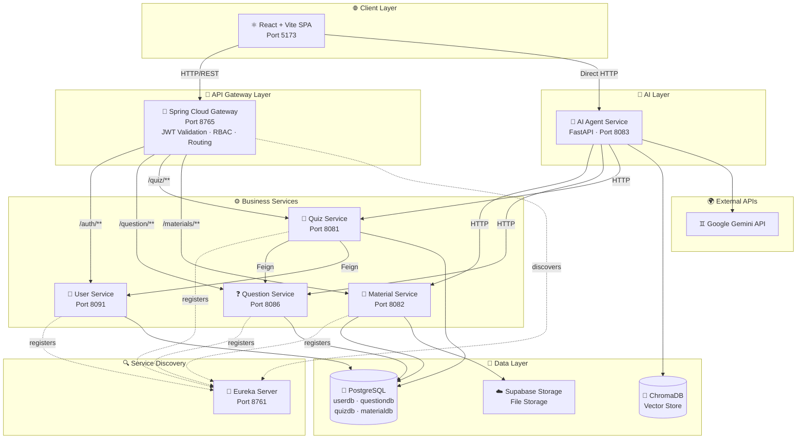
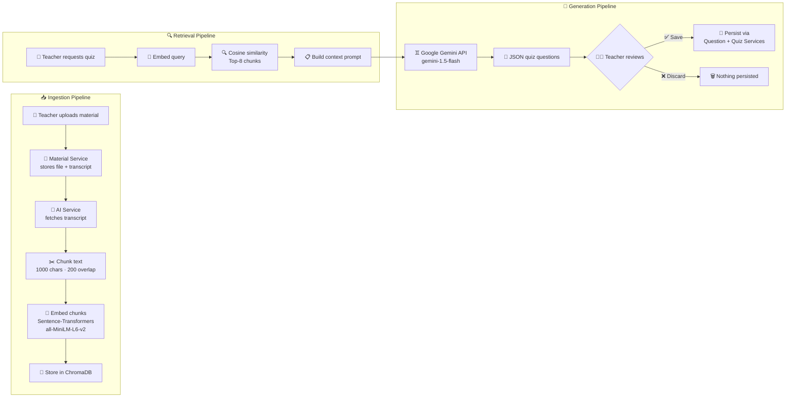
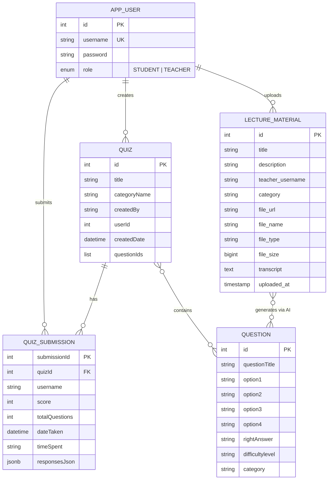
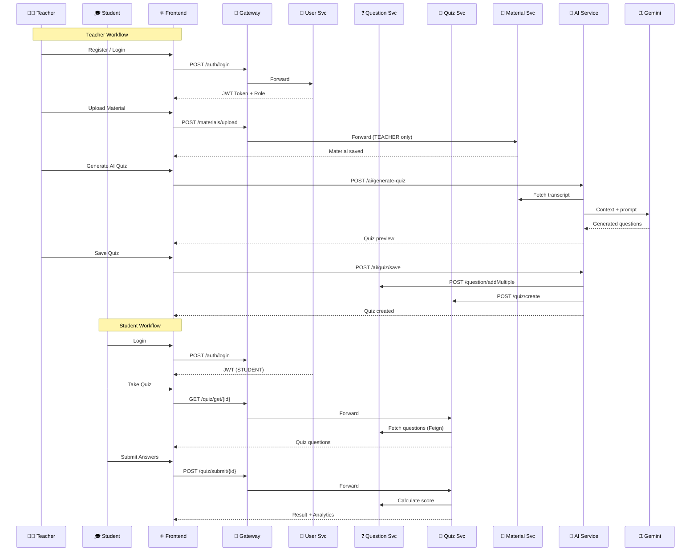

<div align="center">

# 🧠 QuizApp — AI-Powered Quiz Platform

**An intelligent, microservices-based quiz platform with AI-driven question generation, real-time analytics, and role-based access control.**

[](https://spring.io/projects/spring-boot)
[](https://react.dev/)
[](https://fastapi.tiangolo.com/)
[](https://www.postgresql.org/)
[](https://ai.google.dev/)
[](https://www.docker.com/)

[Features](#-features) · [Architecture](#-high-level-architecture) · [AI Architecture](#-ai--rag-architecture) · [Services](#-service-catalog) · [Quick Start](#-quick-start) · [Tech Stack](#-tech-stack)

</div>

---

## ✨ Features

| 👩‍🏫 **Teacher** | 🎓 **Student** | 🤖 **AI-Powered** |
|:---|:---|:---|
| 📝 Create & manage quizzes | 📋 Browse & take quizzes | 🧠 RAG-based quiz generation |
| ❓ Build question bank | 📊 Track quiz history | 💬 AI chat grounded in materials |
| 📂 Upload lecture materials | 🏆 View scores & results | 📈 AI student performance analysis |
| 📊 View analytics per quiz | 🔍 Detailed answer review | 🎯 Difficulty-aware questions |
| 🎯 Custom quiz creator | ⏱️ Timed submissions | 📚 Context from uploaded materials |

---

## 🏗 High-Level Architecture


```mermaid
flowchart TB
    subgraph CLIENT["🌐 Client Layer"]
        FE["⚛️ React + Vite SPA\nPort 5173"]
    end

    subgraph GATEWAY["🚪 API Gateway Layer"]
        GW["🔀 Spring Cloud Gateway\nPort 8765\nJWT Validation · RBAC · Routing"]
    end

    subgraph DISCOVERY["🔍 Service Discovery"]
        EU["📡 Eureka Server\nPort 8761"]
    end

    subgraph SERVICES["⚙️ Business Services"]
        US["👤 User Service\nPort 8091"]
        QS["❓ Question Service\nPort 8086"]
        QZ["📝 Quiz Service\nPort 8081"]
        MS["📂 Material Service\nPort 8082"]
    end

    subgraph AI["🤖 AI Layer"]
        AI_SVC["🧠 AI Agent Service\nFastAPI · Port 8083"]
    end

    subgraph DATA["💾 Data Layer"]
        PG[("🐘 PostgreSQL\nuserdb · questiondb\nquizdb · materialdb")]
        CHROMA[("🔮 ChromaDB\nVector Store")]
        SUPA["☁️ Supabase Storage\nFile Storage"]
    end

    subgraph EXTERNAL["🌍 External APIs"]
        GEMINI["♊ Google Gemini API"]
    end

    FE -->|"HTTP/REST"| GW
    FE -->|"Direct HTTP"| AI_SVC
    GW -->|"/auth/**"| US
    GW -->|"/question/**"| QS
    GW -->|"/quiz/**"| QZ
    GW -->|"/materials/**"| MS

    US -.->|"registers"| EU
    QS -.->|"registers"| EU
    QZ -.->|"registers"| EU
    MS -.->|"registers"| EU
    GW -.->|"discovers"| EU

    QZ -->|"Feign"| QS
    QZ -->|"Feign"| US

    AI_SVC -->|"HTTP"| MS
    AI_SVC -->|"HTTP"| QS
    AI_SVC -->|"HTTP"| QZ

    US --> PG
    QS --> PG
    QZ --> PG
    MS --> PG
    MS --> SUPA

    AI_SVC --> CHROMA
    AI_SVC --> GEMINI
```

---

## 🧩 System Design Overview

```
┌──────────────────────────────────────────────────────────────────────────────────┐
│                              QUIZAPP PLATFORM                                    │
├──────────────────────────────────────────────────────────────────────────────────┤
│                                                                                  │
│   📱 Frontend (React 19 + Vite + Redux Toolkit)                                 │
│   ├── Role-Based UI (Teacher / Student)                                          │
│   ├── JWT Auth with localStorage                                                 │
│   ├── Axios HTTP Client + Interceptors                                           │
│   └── SCSS Styling + Responsive Design                                           │
│                                                                                  │
│   ─────────────────────── HTTP / REST ───────────────────────                    │
│                                                                                  │
│   🔀 API Gateway (Spring Cloud Gateway - Reactive)                               │
│   ├── JWT Validation (HMAC-SHA256)                                               │
│   ├── Role-Based Access Control (TEACHER / STUDENT)                              │
│   ├── Dynamic Routing via Eureka                                                 │
│   ├── CORS Configuration                                                         │
│   └── Header Injection (username propagation)                                    │
│                                                                                  │
│   ─────────────── Load Balanced (Eureka Discovery) ──────────────                │
│                                                                                  │
│   ⚙️ Microservices Layer                                                         │
│   ├── 👤 User Service ──────────── PostgreSQL (userdb)                           │
│   │   └── Auth · JWT · Registration · Role Management                            │
│   ├── ❓ Question Service ──────── PostgreSQL (questiondb)                       │
│   │   └── CRUD · Category Filter · Random Selection · Scoring                    │
│   ├── 📝 Quiz Service ─────────── PostgreSQL (quizdb)                            │
│   │   └── Quiz CRUD · Submissions · Analytics · History                          │
│   └── 📂 Material Service ─────── PostgreSQL (materialdb) + Supabase Storage     │
│       └── File Upload · Transcripts · Category Management                        │
│                                                                                  │
│   ─────────────────────── Direct HTTP ───────────────────────                    │
│                                                                                  │
│   🤖 AI Agent Service (FastAPI + Python)                                         │
│   ├── RAG Pipeline (Embed → ChromaDB → Retrieve → Generate)                     │
│   ├── Google Gemini (gemini-1.5-flash)                                           │
│   ├── Sentence-Transformers (all-MiniLM-L6-v2)                                  │
│   ├── MCP Pattern (Context Server · Memory · AI Agent)                           │
│   └── Quiz Generation · Student Analysis · Chat Agent                            │
│                                                                                  │
└──────────────────────────────────────────────────────────────────────────────────┘
```

---

## 🤖 AI & RAG Architecture

The AI Agent Service uses **Retrieval-Augmented Generation (RAG)** to generate contextually relevant quiz questions from teacher-uploaded study materials.


```mermaid
flowchart LR
    subgraph INGEST["📥 Ingestion Pipeline"]
        A["📂 Teacher uploads material"] --> B["📄 Material Service\nstores file + transcript"]
        B --> C["📨 AI Service\nfetches transcript"]
        C --> D["✂️ Chunk text\n1000 chars · 200 overlap"]
        D --> E["🔢 Embed chunks\nSentence-Transformers\nall-MiniLM-L6-v2"]
        E --> F["💾 Store in ChromaDB"]
    end

    subgraph RETRIEVE["🔍 Retrieval Pipeline"]
        G["🎯 Teacher requests quiz"] --> H["🔢 Embed query"]
        H --> I["🔍 Cosine similarity\nTop-8 chunks"]
        I --> J["📋 Build context prompt"]
    end

    subgraph GENERATE["🧠 Generation Pipeline"]
        J --> K["♊ Google Gemini API\ngemini-1.5-flash"]
        K --> L["📝 JSON quiz questions"]
        L --> M{"👩‍🏫 Teacher reviews"}
        M -->|"✅ Save"| N["💾 Persist via\nQuestion + Quiz Services"]
        M -->|"❌ Discard"| O["🗑️ Nothing persisted"]
    end
```

### 🧬 AI Service Internal Architecture (MCP Pattern)

```
┌─────────────────────────────────────────────────────────────────┐
│                    AI Agent Service (Port 8083)                   │
├─────────────────────────────────────────────────────────────────┤
│                                                                   │
│   📡 Routers                                                     │
│   ├── /ai/generate-quiz      → Quiz Generation Endpoint          │
│   ├── /ai/quiz/save          → Save Generated Quiz               │
│   ├── /ai/analyze-student    → Student Performance Analysis      │
│   ├── /ai/chat               → Material-Grounded Chat            │
│   └── /ai/chat/{session_id}  → Clear Chat Session                │
│                                                                   │
│   🧩 MCP Layer (Model Context Protocol)                          │
│   ├── 📚 Context Server  → Fetches materials from material-svc   │
│   ├── 🧠 Memory          → Per-session conversation history      │
│   └── 🤖 AI Agent        → Gemini API orchestration              │
│                                                                   │
│   ⚙️ Services                                                    │
│   ├── 📄 Document Processor  → PDF extraction + text chunking    │
│   ├── 🔢 Embedding Service   → Sentence-Transformers wrapper     │
│   ├── 💾 Vector Store        → ChromaDB CRUD operations          │
│   ├── 🔍 RAG Service         → Full RAG pipeline orchestration   │
│   └── ♊ Gemini Service       → Gemini API + JSON response parse  │
│                                                                   │
│   🔐 Auth                                                        │
│   └── JWT Validation (matching Spring Boot HS256 secret)         │
│                                                                   │
└─────────────────────────────────────────────────────────────────┘
        │                    │                    │
        ▼                    ▼                    ▼
   📂 Material         ❓ Question           📝 Quiz
    Service              Service               Service
   (Port 8082)         (Port 8086)           (Port 8081)
```

### 🔑 Key AI Capabilities

| Feature | Description | Model / Tool |
|:--------|:------------|:-------------|
| 🧠 **Quiz Generation** | Generates MCQ questions from lecture materials using RAG | Gemini 1.5 Flash + ChromaDB |
| 📈 **Student Analysis** | Analyzes quiz performance and provides insights | Gemini 1.5 Flash |
| 💬 **AI Chat** | Conversational AI grounded in study materials | Gemini + MCP Memory |
| 📄 **Document Processing** | Extracts text from PDFs and chunks for embedding | PyPDF2 + pdfplumber |
| 🔢 **Semantic Embeddings** | Converts text to vectors for similarity search | Sentence-Transformers (all-MiniLM-L6-v2) |
| 💾 **Vector Storage** | Persistent local vector database for retrieval | ChromaDB |

---

## 📦 Service Catalog

| Icon | Service | Type | Port | Tech | Description |
|:----:|:--------|:-----|:----:|:-----|:------------|
| 📡 | [Service Registry](backend/microservices/service-registry/) | 🔍 Infrastructure | `8761` | Spring Cloud Eureka | Service discovery & health monitoring |
| 🔀 | [API Gateway](backend/microservices/api-gateway/) | 🚪 Infrastructure | `8765` | Spring Cloud Gateway | JWT validation, RBAC, routing |
| 👤 | [User Service](backend/microservices/user-service/) | 🔐 Authentication | `8091` | Spring Boot + JPA | Registration, login, JWT, roles |
| ❓ | [Question Service](backend/microservices/questionService/) | 📊 Business Logic | `8086` | Spring Boot + JPA | Question bank CRUD & scoring |
| 📝 | [Quiz Service](backend/microservices/quizService/) | 📊 Business Logic | `8081` | Spring Boot + Feign | Quiz lifecycle, submissions, analytics |
| 📂 | [Material Service](backend/microservices/material-service/) | 📊 Business Logic | `8082` | Spring Boot + Supabase | Lecture material & file management |
| 🤖 | [AI Agent Service](backend/ai-agent-service/) | 🧠 AI / ML | `8083` | FastAPI + Gemini | RAG quiz generation, analysis, chat |
| ⚛️ | [Frontend](frontend/quiz-app/) | 🌐 Client | `5173` | React + Vite + Redux | SPA with role-based UI |

---

## 🗄️ Entity Relationship Overview


```mermaid
erDiagram
    APP_USER {
        int id PK
        string username UK
        string password
        enum role "STUDENT | TEACHER"
    }

    QUESTION {
        int id PK
        string questionTitle
        string option1
        string option2
        string option3
        string option4
        string rightAnswer
        string difficultylevel
        string category
    }

    QUIZ {
        int id PK
        string title
        string categoryName
        string createdBy
        int userId
        datetime createdDate
        list questionIds
    }

    QUIZ_SUBMISSION {
        int submissionId PK
        int quizId FK
        string username
        int score
        int totalQuestions
        datetime dateTaken
        string timeSpent
        jsonb responsesJson
    }

    LECTURE_MATERIAL {
        int id PK
        string title
        string description
        string teacher_username
        string category
        string file_url
        string file_name
        string file_type
        bigint file_size
        text transcript
        timestamp uploaded_at
    }

    APP_USER ||--o{ QUIZ : "creates"
    APP_USER ||--o{ QUIZ_SUBMISSION : "submits"
    APP_USER ||--o{ LECTURE_MATERIAL : "uploads"
    QUIZ ||--o{ QUIZ_SUBMISSION : "has"
    QUIZ }o--o{ QUESTION : "contains"
    LECTURE_MATERIAL }o--o{ QUESTION : "generates via AI"
```

---

## 🔄 Application Flow Diagram


```mermaid
sequenceDiagram
    participant T as 👩‍🏫 Teacher
    participant S as 🎓 Student
    participant FE as ⚛️ Frontend
    participant GW as 🔀 Gateway
    participant US as 👤 User Svc
    participant QS as ❓ Question Svc
    participant QZ as 📝 Quiz Svc
    participant MS as 📂 Material Svc
    participant AI as 🤖 AI Service
    participant GM as ♊ Gemini

    Note over T,FE: Teacher Workflow
    T->>FE: Register / Login
    FE->>GW: POST /auth/login
    GW->>US: Forward
    US-->>FE: JWT Token + Role

    T->>FE: Upload Material
    FE->>GW: POST /materials/upload
    GW->>MS: Forward (TEACHER only)
    MS-->>FE: Material saved

    T->>FE: Generate AI Quiz
    FE->>AI: POST /ai/generate-quiz
    AI->>MS: Fetch transcript
    AI->>GM: Context + prompt
    GM-->>AI: Generated questions
    AI-->>FE: Quiz preview

    T->>FE: Save Quiz
    FE->>AI: POST /ai/quiz/save
    AI->>QS: POST /question/addMultiple
    AI->>QZ: POST /quiz/create
    AI-->>FE: Quiz created

    Note over S,FE: Student Workflow
    S->>FE: Login
    FE->>GW: POST /auth/login
    US-->>FE: JWT (STUDENT)

    S->>FE: Take Quiz
    FE->>GW: GET /quiz/get/{id}
    GW->>QZ: Forward
    QZ->>QS: Fetch questions (Feign)
    QZ-->>FE: Quiz questions

    S->>FE: Submit Answers
    FE->>GW: POST /quiz/submit/{id}
    GW->>QZ: Forward
    QZ->>QS: Calculate score
    QZ-->>FE: Result + Analytics
```

---

## 🛠 Tech Stack

### Backend

| Technology | Purpose |
|:-----------|:--------|
| ☕ **Java 17** | Primary language for microservices |
| 🌱 **Spring Boot 3.5.3** | Application framework |
| ☁️ **Spring Cloud 2025.0.0** | Microservices infrastructure |
| 🔀 **Spring Cloud Gateway** | API gateway (reactive) |
| 📡 **Netflix Eureka** | Service discovery |
| 🔗 **OpenFeign** | Declarative service-to-service HTTP |
| 🔐 **Spring Security** | Authentication & authorization |
| 🗄️ **Spring Data JPA** | Database ORM |
| 🐘 **PostgreSQL 15** | Relational database (4 databases) |
| 🔑 **JJWT 0.11.5** | JWT token generation & validation |
| 📦 **Maven 3.9** | Build & dependency management |

### AI Service

| Technology | Purpose |
|:-----------|:--------|
| 🐍 **Python 3.11+** | AI service language |
| ⚡ **FastAPI 0.109+** | REST API framework |
| ♊ **Google Gemini** (gemini-1.5-flash) | LLM for question generation & analysis |
| 🔮 **ChromaDB 0.5+** | Local vector database |
| 🔢 **Sentence-Transformers 2.4+** | Text embeddings (all-MiniLM-L6-v2) |
| 📄 **PyPDF2 + pdfplumber** | PDF text extraction |
| 🌐 **httpx 0.26+** | Async HTTP client |
| 🔑 **PyJWT 2.8+** | JWT validation |

### Frontend

| Technology | Purpose |
|:-----------|:--------|
| ⚛️ **React 19** | UI library |
| ⚡ **Vite 7** | Build tool & dev server |
| 🗃️ **Redux Toolkit 2.11** | State management |
| 🧭 **React Router 7.7** | Client-side routing |
| 📡 **Axios 1.10** | HTTP client |
| 🎨 **Sass 1.98** | SCSS styling |

### Infrastructure

| Technology | Purpose |
|:-----------|:--------|
| 🐳 **Docker** | Containerization (multi-stage builds) |
| 🐙 **Docker Compose** | Multi-container orchestration |
| ☁️ **Supabase Storage** | Cloud file storage |
| 🔮 **ChromaDB** | Local vector database |

---

## 🚀 Quick Start

### Prerequisites

| Tool | Version | Required For |
|:-----|:--------|:-------------|
| 🐳 Docker & Docker Compose | Latest | All services (recommended) |
| ☕ JDK | 17+ | Backend microservices (local dev) |
| 📦 Maven | 3.9+ | Building Java services (local dev) |
| 📗 Node.js | 18+ | Frontend (local dev) |
| 🐍 Python | 3.11+ | AI service (local dev) |
| 🐘 PostgreSQL | 15 | Database (local dev) |

### 🐳 Option 1: Docker Compose (Recommended)

```bash
# 1. Clone the repository
git clone https://github.com/aryanjais1234/quizApp.git
cd quizApp/backend/microservices

# 2. Create environment file
cp .env.example .env
# Edit .env and set: SUPABASE_URL, SUPABASE_SERVICE_KEY, GEMINI_API_KEY

# 3. Build and start all services
docker compose build
docker compose up -d

# 4. Verify services are running
docker compose ps
```

**Access Points:**

| Service | URL |
|:--------|:----|
| 🌐 Frontend | http://localhost:5173 |
| 🔀 API Gateway | http://localhost:8765 |
| 📡 Eureka Dashboard | http://localhost:8761 |
| 🤖 AI Service Swagger | http://localhost:8083/docs |

### 💻 Option 2: Local Development (8 Terminals)

<details>
<summary>Click to expand local development setup</summary>

**Step 1 — Create databases:**

```sql
CREATE DATABASE userdb;
CREATE DATABASE questiondb;
CREATE DATABASE quizdb;
CREATE DATABASE materialdb;
```

**Step 2 — Start Service Registry (Terminal 1):**

```bash
cd backend/microservices/service-registry
mvn spring-boot:run
# ➜ http://localhost:8761
```

**Step 3 — Start User Service (Terminal 2):**

```bash
cd backend/microservices/user-service
mvn spring-boot:run
# ➜ http://localhost:8091
```

**Step 4 — Start Question Service (Terminal 3):**

```bash
cd backend/microservices/questionService
mvn spring-boot:run
# ➜ http://localhost:8086
```

**Step 5 — Start Quiz Service (Terminal 4):**

```bash
cd backend/microservices/quizService
mvn spring-boot:run
# ➜ http://localhost:8081
```

**Step 6 — Start Material Service (Terminal 5):**

```bash
cd backend/microservices/material-service
export SUPABASE_URL=https://your-project.supabase.co
export SUPABASE_SERVICE_KEY=your-service-key
export SUPABASE_BUCKET=lecture-materials
mvn spring-boot:run
# ➜ http://localhost:8082
```

**Step 7 — Start API Gateway (Terminal 6):**

```bash
cd backend/microservices/api-gateway
mvn spring-boot:run
# ➜ http://localhost:8765
```

**Step 8 — Start AI Agent Service (Terminal 7):**

```bash
cd backend/ai-agent-service
python -m venv venv
source venv/bin/activate
pip install -r requirements.txt
cp .env.example .env   # Edit and set GEMINI_API_KEY
uvicorn app.main:app --host 0.0.0.0 --port 8083 --reload
# ➜ http://localhost:8083/docs
```

**Step 9 — Start Frontend (Terminal 8):**

```bash
cd frontend/quiz-app
npm install
npm run dev
# ➜ http://localhost:5173
```

</details>

---

## 📂 Project Structure

```
quizApp/
├── 📄 README.md                              ← You are here
├── backend/
│   ├── 🤖 ai-agent-service/                  ← FastAPI AI service
│   │   ├── app/
│   │   │   ├── main.py                        ← Entry point
│   │   │   ├── config.py                      ← Settings (.env)
│   │   │   ├── routers/                       ← API endpoints
│   │   │   ├── services/                      ← Business logic
│   │   │   ├── models/                        ← Schemas & prompts
│   │   │   ├── mcp/                           ← MCP pattern layers
│   │   │   └── utils/                         ← JWT auth
│   │   ├── requirements.txt
│   │   └── Dockerfile
│   ├── microservices/
│   │   ├── 📡 service-registry/               ← Eureka Server
│   │   ├── 🔀 api-gateway/                    ← Spring Cloud Gateway
│   │   ├── 👤 user-service/                   ← Auth & Users
│   │   ├── ❓ questionService/                ← Question Bank
│   │   ├── 📝 quizService/                    ← Quiz Management
│   │   ├── 📂 material-service/               ← Lecture Materials
│   │   ├── 🐳 docker-compose.yml              ← Orchestration
│   │   └── 🗄️ init-db/init.sql                ← DB initialization
│   └── 📮 Quiz APP.postman_collection.json    ← API test suite
└── frontend/
    └── ⚛️ quiz-app/                           ← React SPA
        ├── src/
        │   ├── pages/                         ← Route components
        │   ├── components/                    ← Shared UI
        │   ├── store/                         ← Redux slices
        │   ├── api/                           ← Axios API calls
        │   └── styles/                        ← SCSS stylesheets
        ├── package.json
        └── vite.config.js
```

---

## 🔐 Security Architecture

```
┌────────────────────────────────────────────────────────────────┐
│                     Security Flow                               │
├────────────────────────────────────────────────────────────────┤
│                                                                 │
│  1. 🔑 Registration                                            │
│     POST /auth/register → User Service                         │
│     └── Password hashed → Stored in userdb                     │
│                                                                 │
│  2. 🔐 Login                                                   │
│     POST /auth/login → User Service                            │
│     └── Returns JWT (HS256) with username + role                │
│                                                                 │
│  3. 🛡️ Request Authentication                                  │
│     Frontend sends: Authorization: Bearer <JWT>                 │
│     └── API Gateway validates signature & expiry                │
│                                                                 │
│  4. 🎭 Role-Based Access Control                                │
│     Gateway extracts role from JWT and enforces:                │
│     ├── TEACHER → create quiz, add questions, upload material   │
│     ├── STUDENT → take quiz, submit answers                     │
│     └── Public → /auth/register, /auth/login                   │
│                                                                 │
│  5. 👤 Username Propagation                                     │
│     Gateway injects 'username' header to downstream services    │
│     └── Services use header instead of re-parsing JWT           │
│                                                                 │
└────────────────────────────────────────────────────────────────┘
```

| Route | Allowed Roles | Service |
|:------|:-------------|:--------|
| `POST /auth/**` | 🌍 Public | User Service |
| `GET /question/**` | 👩‍🏫 TEACHER | Question Service |
| `POST /quiz/create` | 👩‍🏫 TEACHER | Quiz Service |
| `POST /quiz/submit/**` | 🎓 STUDENT | Quiz Service |
| `POST /materials/upload` | 👩‍🏫 TEACHER | Material Service |
| `POST /ai/generate-quiz` | 🔐 Any Auth | AI Service |

---

## 🔧 Environment Variables

<details>
<summary>All environment variables</summary>

### Docker Compose / Backend

| Variable | Default | Description |
|:---------|:--------|:------------|
| `POSTGRES_USER` | `postgres` | PostgreSQL username |
| `POSTGRES_PASSWORD` | `aryan` | PostgreSQL password |
| `SUPABASE_URL` | — | Supabase project URL |
| `SUPABASE_SERVICE_KEY` | — | Supabase service role key |
| `SUPABASE_BUCKET` | `lecture-materials` | Supabase storage bucket |
| `EUREKA_CLIENT_SERVICEURL_DEFAULTZONE` | `http://localhost:8761/eureka/` | Eureka URL |

### AI Agent Service

| Variable | Default | Description |
|:---------|:--------|:------------|
| `GEMINI_API_KEY` | — *(required)* | Google Gemini API key |
| `GEMINI_MODEL` | `gemini-1.5-flash` | Gemini model name |
| `JWT_SECRET` | — | Must match User Service secret |
| `JWT_ALGORITHM` | `HS256` | JWT algorithm |
| `CHROMA_PERSIST_DIR` | `./chroma_data` | ChromaDB storage path |
| `EMBEDDING_MODEL` | `all-MiniLM-L6-v2` | Sentence-Transformer model |
| `MATERIAL_SERVICE_URL` | `http://localhost:8082` | Material Service base URL |
| `QUESTION_SERVICE_URL` | `http://localhost:8086` | Question Service base URL |
| `QUIZ_SERVICE_URL` | `http://localhost:8081` | Quiz Service base URL |

</details>

---

## 🔮 Roadmap & Improvements

- 📐 **Database Migrations** — Flyway or Liquibase per service
- ⚙️ **Centralized Config** — Spring Cloud Config Server
- 📊 **Observability** — Prometheus + Grafana + OpenTelemetry
- 🔄 **Resilience** — Circuit breaker with Resilience4j
- 📨 **Messaging** — Kafka/RabbitMQ for async flows
- ⚡ **Caching** — Redis for hot queries
- 🔒 **Security Hardening** — Refresh tokens, mTLS, rate limiting
- 🚀 **CI/CD** — GitHub Actions pipeline
- ☸️ **Kubernetes** — Container orchestration & horizontal scaling

---

## 🤝 Contributing

1. Fork the repository
2. Create a feature branch (`git checkout -b feature/amazing-feature`)
3. Commit changes (`git commit -m 'Add amazing feature'`)
4. Push to branch (`git push origin feature/amazing-feature`)
5. Open a Pull Request

---

## 📄 License

This project is licensed under the **MIT License**. See [LICENSE](LICENSE) for details.

---

<div align="center">

**Built with ❤️ using Spring Boot · React · FastAPI · Google Gemini**

⭐ Star this repo if you find it useful!

</div>
